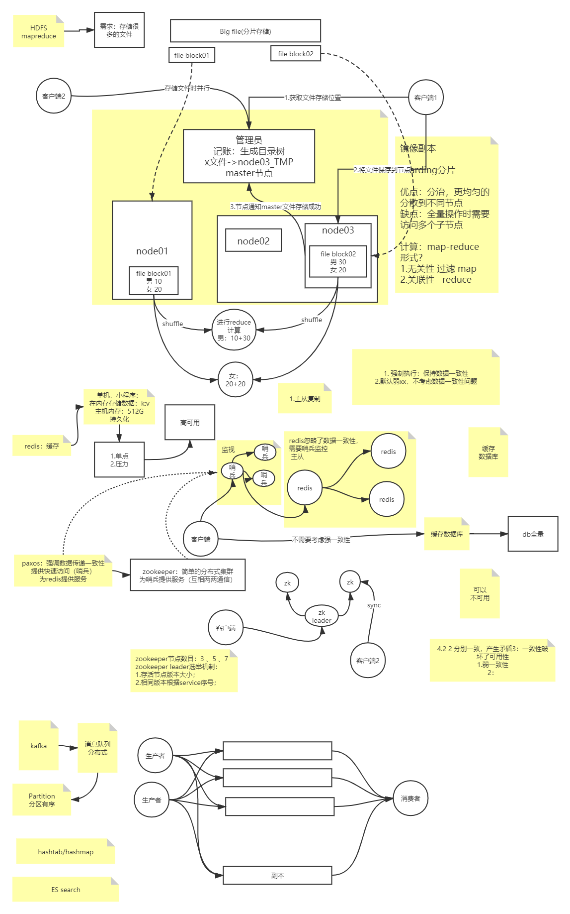

# Skill-All-Container



### 资源网址

- [中国国家候选队论文1999-2019](https://github.com/enkerewpo/OI-Public-Library/tree/master/IOI中国国家候选队论文1999-2019#数据结构-1)
- [Mermaid js实现的流程图](https://mermaid-js.github.io/mermaid/#/)
- [软件工程技术面试个人指南](https://github.com/kdn251/interviews/blob/master/README-zh-cn.md#数据结构)
- [项目实践：SpringBoot三招组合拳，手把手教你打出优雅的后端接口](https://zhuanlan.zhihu.com/p/134209666)
- [Spring core 5.2.2.RELEASE](https://docs.spring.io/spring/docs/5.2.2.RELEASE/spring-framework-reference/core.html#spring-core)
- [Java 视频教程全集](https://www.bilibili.com/video/BV1Jt411g7g4?p=125)

### 实用技巧

#### Windows10

- [windows生成文档树目录](./skills/windows生成文档树目录.md)
- [Win10使用技巧](./skills/Win10使用技巧.md)

#### VMware安装CentOS

- [VMware15安装CentOS](./skills/VMware15安装CentOS.md)
- [docker安装](https://gitee.com/letoco/docker-learning)
- [Linux命令](./skills/Linux命令.md)

#### 浏览器

- [Chrome浏览器设置](./skills/Chrome浏览器设置.md)
- [快速静态html编写](./skills/快速静态html编写.md)

#### git

- [git常用命令](./skills/git命令图表.pdf)

#### Idea

- [IDEA快捷键](./skills/IDEA快捷键.md)

#### 其他

- [笔记](http://git.songfang.top)
- [二进制小技巧](./skills/二进制小技巧.md)

### 问题

- [VMware Workstation 与 Device/Credential Guard 不兼容](./questions/VMwareWorkstation与DeviceCredentialGuard不兼容.md.md)
- [解决idea中tomcat中文乱码](./questions/解决idea中tomcat中文乱码.md)

### 笔记

#### TCP/IP笔记

- [概述](./learn/网络/概述.md)
- [链路层](./网络/链路层.md)
- [Web请求过程](./网络/Web请求过程.md)

#### MyBatis

- [mybatis插入数据后返回自增主键ID详解](./learn/mybatis/mybatis插入数据后返回自增主键ID详解.md)

### Ajax

- [通过url获取参数](./learn/ajax/通过url获取参数.md)

### 文件目录

```
│  git-fetch-push.bat
│  README.md
│  README.txt
│  tree-set.bat
│  _config.yml
│  分布式.png
│  
├─learn
│  ├─ajax
│  │      通过url获取参数.md
│  │      
│  ├─mybatis
│  │      mybatis插入数据后返回自增主键ID详解.md
│  │      
│  └─网络
│      │  概述.md
│      │  链路层.md
│      │  
│      └─images
│              IEEE802与以太网.png
│              PPP数据帧的格式.png
│              SLIP报文封装.png
│              五类不同的互联网格式.png
│              分用.png
│              封装.png
│              
├─questions
│      VMwareWorkstation与DeviceCredentialGuard不兼容.md
│      解决idea中tomcat中文乱码.md
│      
└─skills
        Chrome浏览器设置.md
        git命令图表.pdf
        IDEA快捷键.md
        VMware15安装CentOS.md
        Win10使用技巧.md
        windows生成文档树目录.md
        二进制小技巧.md
```

