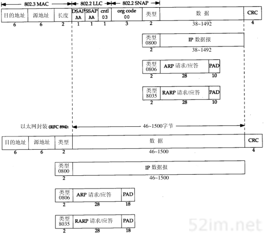
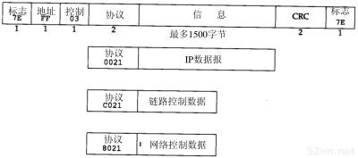

# 链路层

原文链接：[链路层](http://docs.52im.net/extend/docs/book/tcpip/vol1/2/)

在TCP/IP协议族中，链路层主要有三个目的：

- 为IP模块发送和接收IP数据报；
- 为ARP模块发送ARP请求和接收ARP应答；
- 为RARP发送RARP请求和接收RARP应答。

### 以太网和IEEE 802封装

以太网：TCP/IP采用的主要的局域网技术。它采用一种称作CSMA/CD的媒体接入方法，其意思是带冲突检测的载波侦听多路接入（Carrier Sense, Multiple Access with Collision Detection）。它的速率为10 Mb/s，地址为48 bit。

IEEE（电子电气工程师协会） 802委员会公布的标准集：

- 802.3：针对CSMA/CD网络
- 802.4针对令牌总线网络
- 802.5针对令牌环网络

以上三个标准共同特性由802.2标准来定义，那就是802网络共有的逻辑链路控制（LLC）。

在TCP/IP世界中，**以太网IP数据报的封装**是在RFC 894[Hornig 1984]中定义的，**IEEE 802网络的IP数据报**封装是在RFC 1042[Postel and Reynolds 1988]中定义的。主机需求RFC要求每台Internet主机都与一个10 Mb/s的以太网电缆相连接：

1. 必须能发送和接收采用RFC 894（以太网）封装格式的分组。
2. 应该能接收与RFC 894混合的RFC 1042（IEEE 802）封装格式的分组。
3. 也许能够发送采用RFC 1042格式封装的分组。如果主机能同时发送两种类型的分组数据，那么发送的分组必须是可以设置的，而且默认条件下必须是RFC 894分组。

**IEEE802.2/802.3(RFC 1042)与以太网的封装格式(RFC 894)：**

共同点：

- 方框下面的数字为字节长度；
- 两种帧均采用48bit（6字节）的目的地址和源地址，即硬件地址（MAC地址）。ARP和RARP协议对32bit的IP地址和48为的硬件地址进行映射；

不同点：

- 源地址后2字节：

  - 802：长度字段是指它后续数据的字节长度，但不包括CRC检验码；

    在802标准定义的帧格式中，类型字段则由后续的子网接入协议（Sub-network Access Protocol，SNAP）的首部给出。幸运的是，802定义的有效长度值与以太网的有效类型值无一相同，这样，就可以对两种帧格式进行区分。

  - 以太网：类型字段定义了后续数据的类型；

- 在以太网帧格式中，类型字段之后就是数据；而在802帧格式中，跟随在后面的是3字节的802.2LLC和5字节的802.2SNAP。

  - 目的服务访问点（Destination Service Access Point, DSAP）和源服务访问点（Source Service Access Point, SSAP）的值都设为0xaa。
  - Ctrl字段的值设为3。随后的3个字节org code都置为0。再接下来的2个字节类型字段和以太网帧格式一样

- CRC字段用于帧内后续字节差错的循环冗余码检验（检验和）（它也被称为FCS或帧检验序列）。

- 802.3标准定义的帧和以太网的帧都有最小长度要求。802.3规定数据部分必须至少为38字节，而对于以太网，则要求最少要有46字节。为了保证这一点，必须在不足的空间插入填充（pad）字节。在开始观察线路上的分组时将遇到这种最小长度的情况。

### SLIP：串行线路IP

SLIP的全称是Serial Line IP。它是一种在串行线路上对IP数据报进行封装的简单形式，在RFC 1055[Romkey 1988]中有详细描述，是一种广泛使用的协议。SLIP适用于家庭中每台计算机几乎都有的RS-232串行端口和高速调制解调器接入Internet。

下面的规则描述了SLIP协议定义的帧格式：

1. IP数据报以一个称作END（0xc0）的特殊字符结束。同时，为了防止数据报到来之前的线路噪声被当成数据报内容，大多数实现在数据报的开始处也传一个END字符（如果有线路噪声，那么END字符将结束这份错误的报文。这样当前的报文得以正确地传输，而前一个错误报文交给上层后，会发现其内容毫无意义而被丢弃）。
2. 如果IP报文中某个字符为END，那么就要连续传输两个字节0xdb和0xdc来取代它。0xdb这个特殊字符被称作SLIP的ESC字符，但是它的值与ASCII码的ESC字符（0x1b）不同。
3. 如果IP报文中某个字符为SLIP的ESC字符，那么就要连续传输两个字节0xdb和0xdd来取代它。

上面示例：就是含有一个END字符和一个ESC字符的IP报文。在这个例子中，在串行线路上传输的总字节数是原IP报文长度再加4个字节。

SLIP是一种简单的帧封装方法，还有一些值得一提的缺陷：

1. 每一端必须知道对方的IP地址。没有办法把本端的IP地址通知给另一端。
2. 数据帧中没有类型字段（类似于以太网中的类型字段）。如果一条串行线路用于SLIP，那么它不能同时使用其他协议。
3. SLIP没有在数据帧中加上检验和（类似于以太网中的CRC字段）。如果SLIP传输的报文被线路噪声影响而发生错误，只能通过上层协议来发现（另一种方法是，新型的调制解调器可以检测并纠正错误报文）。这样，上层协议提供某种形式的CRC就显得很重要。IP首部和TCP首部及其数据始终都有检验和。UDP首部及其数据的检验和却是可选的。

压缩的SLIP：CSLIP（即压缩SLIP）的新协议，它在RFC 1144[Jacobson 1990a]中被详细描述。CSLIP一般能把上面的40个字节压缩到3或5个字节。它能在CSLIP的每一端维持多达16个TCP连接，并且知道其中每个连接的首部中的某些字段一般不会发生变化。对于那些发生变化的字段，大多数只是一些小的数字和的改变。这些被压缩的首部大大地缩短了交互响应时间。

### PPP：点对点协议

PPP，点对点协议修改了SLIP协议中的所有缺陷。PPP包括以下三个部分：

1. 在串行链路上封装IP数据报的方法。PPP既支持数据为8位和无奇偶检验的异步模式（如大多数计算机上都普遍存在的串行接口），还支持面向比特的同步链接。
2. 建立、配置及测试数据链路的链路控制协议（LCP：Link Control Protocol）。它允许通信双方进行协商，以确定不同的选项。
3. 针对不同网络层协议的网络控制协议（NCP：Network Control Protocol）体系。当前RFC定义的网络层有IP、OSI网络层、DECnet以及AppleTalk。例如，IP NCP允许双方商定是否对报文首部进行压缩，类似于CSLIP（缩写词NCP也可用在TCP的前面）。

RFC 1548[Simpson 1993]描述了报文封装的方法和链路控制协议。RFC 1332[McGregor 1992]描述了针对IP的网络控制协议。PPP数据帧的格式看上去很像ISO的HDLC（高层数据链路控制）标准。图2-3是PPP数据帧的格式。

每一帧都以标志字符0x7e开始和结束。紧接着是一个地址字节，值始终是0xff，然后是一个值为0x03的控制字节。

接下来是协议字段，类似于以太网中类型字段的功能。当它的值为0x0021时，表示信息字段是一个IP数据报；值为0xc021时，表示信息字段是链路控制数据；值为0x8021时，表示信息字段是网络控制数据。

CRC字段（或FCS，帧检验序列）是一个循环冗余检验码，以检测数据帧中的错误。

由于标志字符的值是0x7e，因此当该字符出现在信息字段中时，PPP需要对它进行转义。在同步链路中，该过程是通过一种称作比特填充(bit stuffing)的硬件技术来完成的[Tanenbaum 1989]。在异步链路中，特殊字符0x7d用作转义字符。当它出现在PPP数据帧中时，那么紧接着的字符的第6个比特要取其补码，具体实现过程如下：

1. 当遇到字符0x7e时，需连续传送两个字符：0x7d和0x5e，以实现标志字符的转义。
2. 当遇到转义字符0x7d时，需连续传送两个字符：0x7d和0x5d，以实现转义字符的转义。
3. 默认情况下，如果字符的值小于0x20（比如，一个ASCII控制字符），一般都要进行转义。例如，遇到字符0x01时需连续传送0x7d和0x21两个字符（这时，第6个比特取补码后变为1，而前面两种情况均把它变为0）。

这样做的原因是防止它们出现在双方主机的串行接口驱动程序或调制解调器中，因为有时它们会把这些控制字符解释成特殊的含义。另一种可能是用链路控制协议来指定是否需要对这32个字符中的某一些值进行转义。默认情况下是对所有的32个字符都进行转义。

与SLIP类似，由于PPP经常用于低速的串行链路，因此减少每一帧的字节数可以降低应用程序的交互时延。利用链路控制协议，大多数的产品通过协商可以省略标志符和地址字段，并且把协议字段由2个字节减少到1个字节。如果我们把PPP的帧格式与前面的SLIP的帧格式（图2-2）进行比较会发现，PPP只增加了3个额外的字节：1个字节留给协议字段，另2个给CRC字段使用。另外，使用IP网络控制协议，大多数的产品可以通过协商采用Van Jacobson报文首部压缩方法（对应于CSLIP压缩），减小IP和TCP首部长度。

总的来说，PPP比SLIP具有下面这些优点：(1)PPP支持在单根串行线路上运行多种协议，不只是IP协议；(2)每一帧都有循环冗余检验；(3)通信双方可以进行IP地址的动态协商(使用IP网络控制协议)；(4)与CSLIP类似，对TCP和IP报文首部进行压缩；(5)链路控制协议可以对多个数据链路选项进行设置。为这些优点付出的代价是在每一帧的首部增加3个字节，当建立链路时要发送几帧协商数据，以及更为复杂的实现。